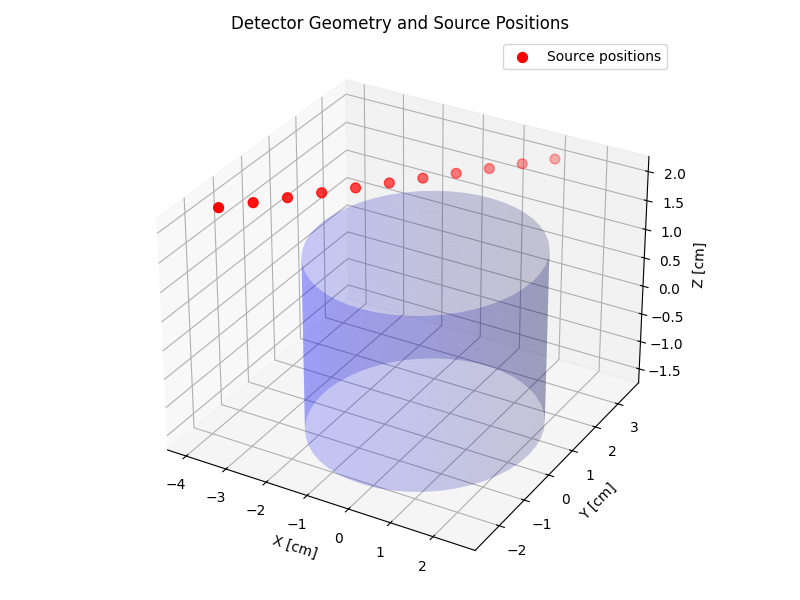

# Monte Carlo Simulation of Photon Transport in a NaI Scintillation Detector

This project simulates gamma photon transport using a Monte Carlo method within a cylindrical Sodium Iodide (NaI) scintillation detector. The goal is to generate realistic gamma-ray spectra and calculate detector efficiencies by simulating individual photon interactions based on physical cross sections.

  

---

## Simulation Background

Monoenergetic gamma photons emitted isotropically from a point source are simulated as they interact with a NaI scintillation detector. The simulation tracks these photons as they undergo physical processes such as:

- **Photoelectric absorption**  
- **Compton scattering**  
- **Pair production**

These interactions are probabilistically sampled using cross-section data from the **NIST XCOM** database. The trajectory of each photon is updated step-by-step until absorption or escape. Energy deposited by interactions is recorded in a histogram to generate a gamma-ray spectrum, smoothed using a Gaussian detector resolution model.

The final gamma-ray spectrum represents energy deposited within the detector and includes features like:

- **Photopeaks** (full absorption)  
- **Compton continua** (partial energy deposition)  
- **Escape peaks** (for pair production)

---

## Sample Result – Gamma Spectrum

  

- Source energy: 1332.5 keV  
- Detector resolution: 6 keV FWHM  
- Spectrum includes photopeak and Compton edge  
- 1024-channel histogram with Gaussian broadening

---

## 🗂 Project Structure

.
.
├── codes/
│   ├── main.py                              # Main simulation script
│   ├── cross_sections_data.py               # Loads and interpolates cross-section data
│   ├── transport_simulation.py              # Photon physics (Compton, photoelectric, etc.)
│   ├── calculating_geometric_properties.py  # 3D geometry and bounding checks
│   ├── energy_calculation.py                # Builds 1024-channel energy spectrum
│   ├── monte_carlo_initialisations.py       # Random vector generation, FWHM, etc.
├── plots_and_data/
│   ├── energy_spectrum_A.png
│   ├── energy_spectrum_B.png
│   ├── detector_geometry.png
│   ├── efficiencies_vs_position.png
│   ├── efficiencies_vs_energy.png
│   └── cross_sections_data.txt
---

## Features

- Isotropic photon emission from a 3D point source  
- Compton scattering, photoelectric absorption, pair production  
- NIST XCOM-based cross-section interpolation  
- Energy histogram with resolution convolution  
- Efficiency calculation of the detector
